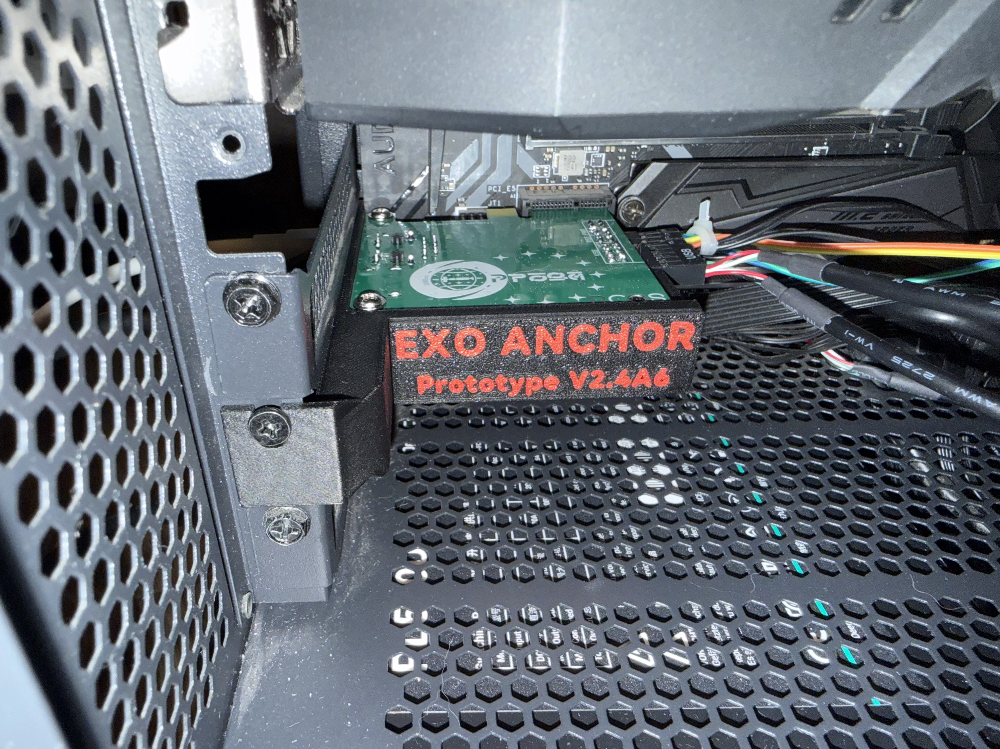
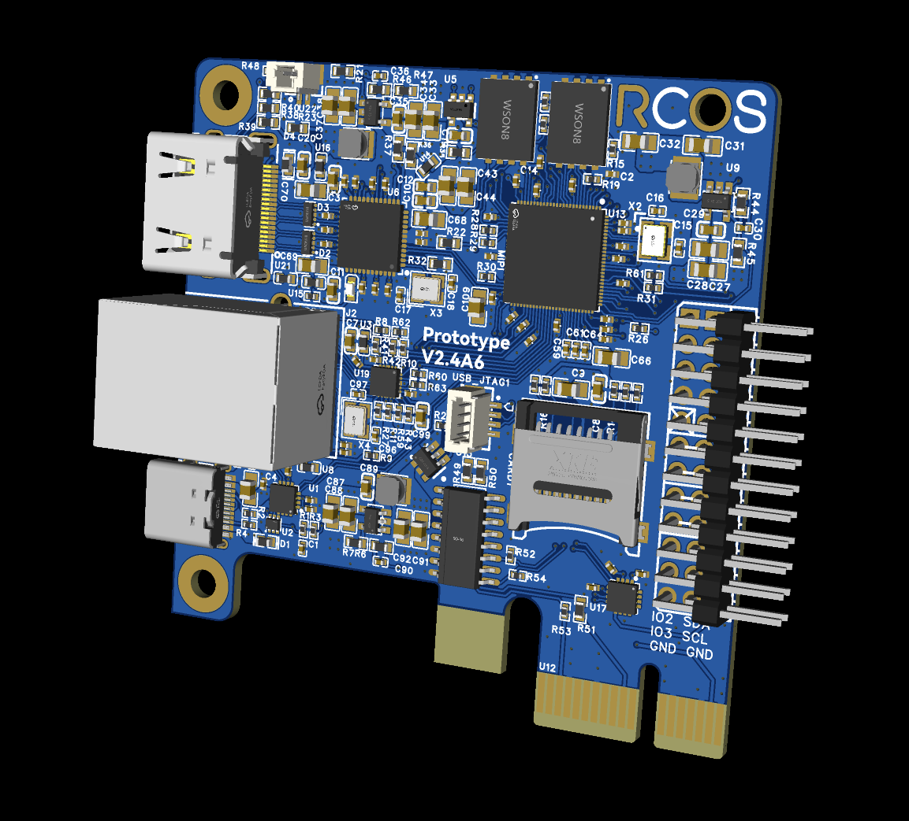

# ExoAnchor

**An Another [RCOS](https://rcos.io/) project**

**[English](README.md)**

ExoAnchor 是一个完全采用 [MIT License](LICENSE) 开源的全功能KVM，基于MCU和RTOS，AI agent based的嵌入式硬件项目。

> 当前开发固件：`0.87.2-dev IndigoShore`。项目处于开发和硬件验证阶段，
> 不是 RC、正式版或量产声明。

它以 ESP32-P4 为核心。即使目标机器
的操作系统、SSH、系统网络或服务失效，仍可通过独立网络入口查看画面、发送键盘
和鼠标输入，并在板型实际支持时使用 UART、复位和电源控制。

目标机器不需要安装 ExoAnchor 软件。手动 KVM 始终保持独立可用；设备 API、
设备内 Agent 和外部 MCP 控制器是在这条确定性控制面之上的可选能力。

硬件设计、原理图、PCB/CAD、BOM 和生产资料位于
[ExoAnchor-Hardware](https://github.com/wxffxx/ExoAnchor-Hardware)。

## 核心能力

| 能力 | 说明 |
| --- | --- |
| 视频 | 通过 MS2109 类 UVC 采集路径接收目标机 HDMI 输出 |
| 键盘和鼠标 | 模拟 USB HID，可覆盖 BIOS、启动和操作系统阶段 |
| 独立网络 | ESP32-P4 自身通过以太网提供 Dashboard 和设备 API |
| UART | 只在真实接线并验证的板型上提供目标机串口 |
| 电源和状态 | 只在实现对应线路的板型上提供 PWR、RST、12V 和 3V3AUX |
| 设备内 Agent | 在固件策略、请求批准和控制租约约束下编排观察与动作 |
| 外部控制 | 可选 MCP 适配器直接使用设备 API，不接管设备内 Agent 状态 |

每个板型只报告自己的真实能力。可编译 profile、原理图草案和其他板型的测试结果
不能代替当前硬件的验证证据。

## 当前硬件基线

| # | 实现 | 状态 |
| ---: | --- | --- |
| 1 | ESP32-P4 开发板 + 外接 USB HDMI 采集卡 | 已知良好的冻结参考 |
| 2 | Waveshare ESP32-P4-NANO + 简易扩展板 | 原型 |
| 3 | ExoAnchor Prototype0 | 较完整真机验证参考 |
| 4 | ExoAnchor PrototypeV2.3 | b4 标识实物使用 b6 映射；bring-up 已验证，尚非量产定稿 |

### PrototypeV2.4A6 预览

<p align="center">
  
  
</p>

<p align="center"><sub>PrototypeV2.4A6 机箱内安装实拍（左）与板卡渲染图（右）。</sub></p>

各板型对应的固件配置、ESP32-P4 芯片版本和验证状态见
[ESP32-P4 板型实现矩阵](device/ESP32P4/boards/IMPLEMENTATION_PROFILES_zh.md)。

## 系统结构

```text
浏览器 / Embedded Agent / MCP
              │
              │ Ethernet
              ▼
┌──────────────────────────────────────────┐
│ ESP32-P4 ExoAnchor                       │
│ Dashboard · KVM Core · Device API       │
└─────────────┬─────────────┬──────────────┘
              │             │
       HDMI 采集/UVC     USB HID
              │             │
              └────── 目标机器 ──────┐
                                     │
                     可选 UART/电源 ─┘
```

KVM Core 负责视频、HID、UART 和电源等确定性硬件能力；设备内 Agent 在固件
授权和硬件实际能力范围内调用这些能力。即使 Agent 或模型不可用，人工 KVM
仍可独立工作。

## 从选型到烧录

### 1. 选择硬件、固件和工具链

| 硬件 | 固件 | 构建组合 | ESP-IDF | 入口 |
| --- | --- | --- | --- | --- |
| Waveshare ESP32-P4-NANO DIY | Dev；也可选纯 KVM Stable | `waveshare-p4-nano + esp32p4-rev1` | 5.4.x | [装配与烧录指南](https://github.com/wxffxx/ExoAnchor-Hardware/tree/main/ESP32P4/reference/waveshare-nano-diy) |
| ExoAnchor Prototype0 | Dev 或 Stable | `exoanchor-prototype0 + esp32p4-rev3` | 5.5.4 | [Dev 构建](device/ESP32P4/firmware/v0.86.6-dev/README.md#prototype0rev3已验证参考) · [Stable 构建](device/ESP32P4/firmware/v0.86-stable-kvm/README.md#构建-prototype0) |
| ExoAnchor PrototypeV2.3 | Dev | `exoanchor-prototype-v2.3 + esp32p4-rev3` | 5.5.4 | [V2.3 构建](device/ESP32P4/firmware/v0.86.6-dev/README.md#prototypev23rev3bring-up-主线) |

Dev 是当前 KVM + 设备内 Agent 开发线，运行版本为 `0.87.2-dev`；Stable 是不含
设备内 Agent 的独立纯 KVM 源码线。所有固件版本、升级要求和完整入口见
[固件版本说明](device/ESP32P4/firmware/README.md)。

不同板型和芯片版本不能共用 `sdkconfig` 或 build 目录。烧录前必须确认实物板型，
不要把默认配置烧入未核对的硬件。

### 2. 让 AI Agent 获取源码、构建并烧录

把板卡的开发/烧录 USB 口连接到电脑，在准备存放项目的目录中启动 Codex 或其他
具备终端能力的 AI Agent，然后复制下面的提示词。先替换方括号中的硬件和固件
信息；串口不确定时保留“自动识别”。

```text
请从公开仓库获取 ExoAnchor，并协助我完成复刻、构建和烧录。

我的环境：
- 硬件：[Waveshare ESP32-P4-NANO DIY / ExoAnchor Prototype0 / ExoAnchor PrototypeV2.3]
- 固件：[Dev / Stable KVM]
- 操作系统：[macOS / Linux / Windows]
- 烧录串口：[自动识别 / 实际端口]
- 源码位置：[在当前目录新建 ExoAnchor / 使用现有 ExoAnchor 目录]

请完成以下任务：
1. 如果指定位置还没有源码，执行 git clone https://github.com/wxffxx/ExoAnchor.git；如果已有仓库，先确认它确实是 ExoAnchor，不覆盖其中的本地修改。
2. 进入仓库后先阅读 README_zh.md、device/ESP32P4/firmware/README.md，以及所选固件目录的 README。
3. 根据实物确定唯一正确的 board profile、芯片版本 overlay 和 ESP-IDF 版本；代码与配置文件是最终依据。无法确认板型时停止，不要猜测。
4. 检查本机 ESP-IDF 和串口环境。缺少工具链时说明需要安装的准确版本；任何系统级安装都先征得我的同意。
5. 保留工作区中的已有修改，不执行 git reset、checkout 覆盖、强制 pull 或其他破坏性清理。
6. 为所选板型创建独立 build 目录和 sdkconfig，执行 set-target 和完整 build；不得复用其他板型的生成配置。
7. 构建失败时定位首个有效错误并修复明确属于本次构建的问题，不要通过关闭安全检查或改用其他板型配置绕过错误。
8. 只用只读方式识别候选串口和芯片信息。端口或芯片身份与所选板型不一致时停止。
9. 构建与硬件匹配后，使用 tools/flash-monitor.sh 并显式传入 --build-dir，完成有线全量烧录、串口监视和 DHCP 地址提取。
10. 最后报告源码提交、固件版本、板型、芯片版本、ESP-IDF、build 目录、串口、设备 IP，以及 Ethernet、UVC、HID 的启动状态和所有异常。

安全限制：
- 不向被控主机发送键盘、鼠标、电源或复位动作。
- 不使用 force、擦除整片 Flash 或覆盖其他板型构建目录，除非我明确批准。
- 不输出或写入共享文档中的口令、Token、私钥和本机绝对凭据路径。
```

### 3. 手动获取源码、构建与烧录

```bash
git clone https://github.com/wxffxx/ExoAnchor.git
cd ExoAnchor
```

安装选型表中对应的 ESP-IDF，然后按所选固件和板型执行
[Dev 构建说明](device/ESP32P4/firmware/v0.86.6-dev/README.md)或
[Stable 构建说明](device/ESP32P4/firmware/v0.86-stable-kvm/README.md)中的命令。
构建完成后，在所选固件目录中执行：

```bash
./tools/flash-monitor.sh <PORT> \
  --build-dir <build-dir> \
  --wait-ip \
  --exit-on-ip
```

`<PORT>` 是系统识别到的实际串口，`<build-dir>` 必须与构建命令的 `idf.py -B`
参数完全一致。分区升级要求和直接使用 `idf.py` 的方式见
[固件烧录入口](device/ESP32P4/firmware/README.md#烧录规则)。

### 4. 访问与验收

| 地址 | 用途 |
| --- | --- |
| `http://<board-ip>/` | Dashboard |
| `http://<board-ip>/kvm` | 视频与键鼠控制 |
| `http://<board-ip>/agent` | 设备内 Agent，仅 Dev |
| `http://<board-ip>/terminal` | 目标机 UART，仅 Dev 且取决于板型 |
| `http://<board-ip>/settings` | 设备设置 |

确认 Dashboard 可访问、Ethernet 已获取地址、KVM 有画面且 HID 可用。首次启动
必须替换本地 bootstrap 凭据；共享文档不发布凭据值。

## 项目目录

```text
ExoAnchor/
├── assets/brand/                    # 品牌和 Web 资产
├── device/ESP32P4/
│   ├── boards/                      # 板型与固件 profile 权威映射
│   └── firmware/                    # Stable 与 Dev 独立固件树
├── docs/
│   ├── reproduction/                # 制造与复刻
│   ├── guides/                      # 实用指南
│   └── ROADMAP_zh.md                # 经审阅的公开路线
├── integrations/exoanchor-mcp/      # 可选外部 MCP 控制器
└── LICENSE
```

正式文档入口见[文档地图](docs/README_zh.md)。

## 许可证

ExoAnchor 原创软件、固件和文档采用 [MIT License](LICENSE)。原创硬件设计也采用MIT，包括依据授权范围内设计文件制造和销售硬件的许可。

除非文件或目录另有声明，上述 MIT License 适用于 ExoAnchor 贡献者有权授权的
原创软件、固件、脚本、测试、配置、文档、规范、图表、媒体资源和硬件设计文件；
第三方资料仍遵循各权利人的条款，文件级声明优先。MIT License 不授予 ExoAnchor
名称、Logo 或其他商标权，不包含明确的专利授权，也不代表监管批准、安全认证或
特定硬件用途适用性。
